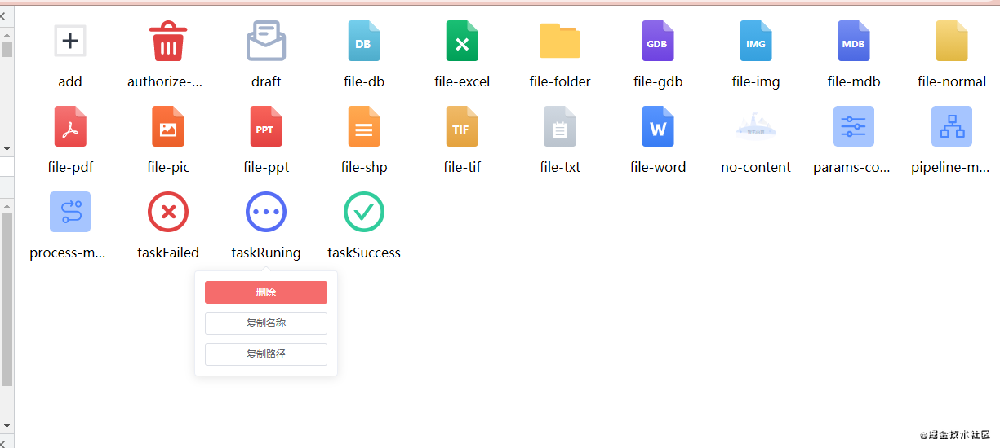

# svg-preview-plugin

说明：解决项目中使用 svg-sprite-loader 导致 svg 文件过多，不好管理的问题



功能：
- 实时预览 svg，动态更新预览内容
- 复制文件名
- 复制文件路径
- 删除文件

# use

```
npm i -D svg-preview-plugin@latest
```

## options

- dirPath: String | Array
  - preview path

- port: Number
  - web port

## example
```
const SvgPreviewPlugin = require('svg-preview-plugin')

module.exports = {
  plugins: [
    new SvgPreviewPlugin({
      dirPath: path.resolve('src/common/icons/svg'),
      port: 3000
    })
  ]
}
```